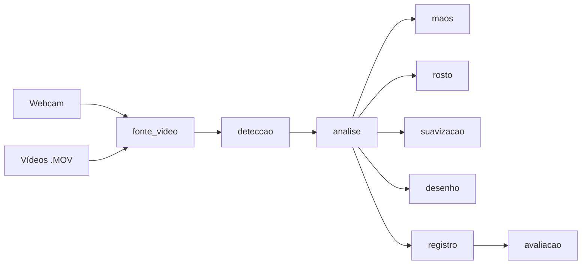

# 🔍 GestoLens — Início

![[demo.gif]]

Mapa de conteúdo do projeto. Abra a raiz do repositório como *vault* no Obsidian e use a **Visão de grafo** (Ctrl+G) para navegar. Instalação, uso (menu **webcam ou vídeos**) e o mapa ilustrado do projeto: [[README]].

![[grafo_vault.png]]

## Exercícios da proposta
1. [[Ex1 - Mão aberta e fechada]]
2. [[Ex2 - Contagem de dedos]]
3. [[Ex3 - Polegar para cima e para baixo]]
4. [[Ex4 - Boca aberta e fechada]]
5. [[Ex5 - Direção do rosto]]

## Módulos do código
- Entrada: [[exercicio_mediapipe]] → [[pipeline]]
- Aquisição e detecção: [[fonte_video]], [[modelos]], [[deteccao]]
- Regras: [[geometria]], [[maos]], [[rosto]], [[suavizacao]], [[analise]]
- Saídas: [[desenho]], [[registro]], [[avaliacao]]
- Parâmetros: [[config]]

## Conceitos
- [[MediaPipe Tasks]]
- [[Landmarks da mão]] · [[Landmarks do rosto]]
- [[Espelhamento]] · [[Proporção da imagem]]
- [[Limiares e calibração]] · [[Suavização temporal]]
- [[Pose facial]]
- [[Privacidade]]

## Avaliação
- [[Protocolo de testes]]
- [[Como preencher rotulos.csv]]
- [[Limitações]]
- [[Resultados]] (notas geradas automaticamente por vídeo)
