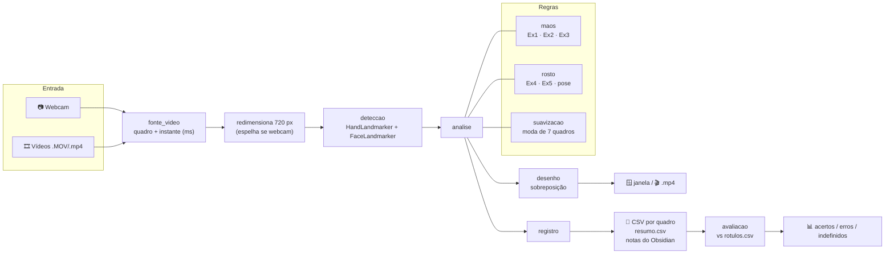
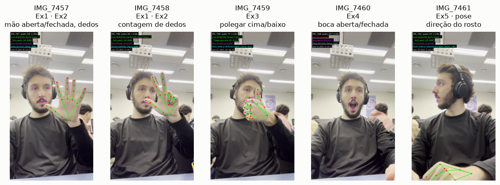
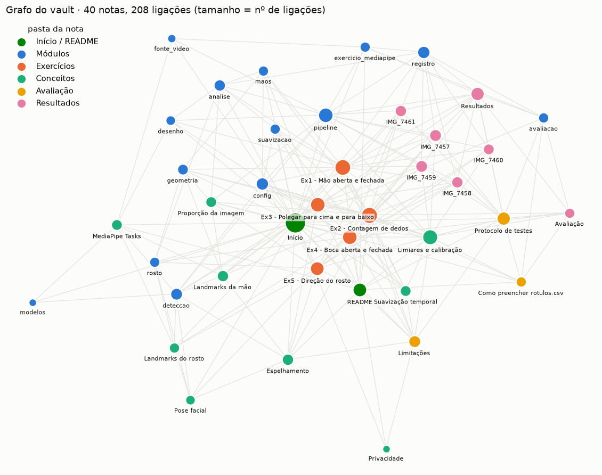

<div align="center">

# 🔍 GestoLens

**Reconhecimento de gestos e expressões com MediaPipe + OpenCV**
Mãos abertas e fechadas, contagem de dedos, polegar para cima/baixo, boca aberta e direção do rosto,
em **vídeos gravados** ou **ao vivo na webcam**.


`Python 3.10+` · `MediaPipe Tasks` · `OpenCV` · regras geométricas explicáveis · documentação em grafo no Obsidian

</div>

---

## Sumário
- [O que o GestoLens faz](#o-que-o-gestolens-faz)
- [Começo rápido](#começo-rápido)
- [Webcam ou vídeos: você escolhe](#webcam-ou-vídeos-você-escolhe)
- [Mapa do fluxo](#mapa-do-fluxo)
- [Os 5 exercícios](#os-5-exercícios)
- [Os vídeos de teste](#os-vídeos-de-teste)
- [Saídas e avaliação](#saídas-e-avaliação)
- [Estrutura do repositório](#estrutura-do-repositório)
- [Documentação em grafo (Obsidian)](#documentação-em-grafo-obsidian)
- [Limitações](#limitações)

---

## O que o GestoLens faz

Implementa as cinco atividades da proposta [*Reconhecimento de gestos e expressões com MediaPipe*](proposta/README.md). Em cada quadro:

1. O **MediaPipe** encontra 21 pontos (landmarks) por mão e 478 no rosto.
2. **Regras geométricas simples**, cada uma com uma fórmula de uma linha, transformam esses pontos em rótulos.
3. O resultado aparece **desenhado sobre o vídeo** e fica **registrado em CSV**, para calibrar os limiares e medir acertos.

| Mão | Rosto |
|---|---|
|  |  |
| Cada dedo tem 4 pontos. As regras comparam **pontas** (4, 8, 12, 16, 20) com **articulações** (3, 6, 10, 14, 18) e com o **punho** (0). | Das 478 marcas, as regras usam só 7: lábios (13, 14), cantos da boca (61, 291), olhos (33, 263) e nariz (1). |

---

## Começo rápido

```bash
git clone <url-do-repo> gestolens
cd gestolens
pip install -r requirements.txt
python exercicio_mediapipe.py
```

Na primeira execução, os modelos `hand_landmarker.task` e `face_landmarker.task` são baixados automaticamente para `modelos/`.

> [!NOTE]
> Versões recentes do MediaPipe (≥ 0.10.14, incluindo a 1.x) **não trazem mais `mp.solutions`**, usado no código-base da proposta. O GestoLens usa a API atual, **MediaPipe Tasks**. Veja a tabela de equivalência em [MediaPipe Tasks](docs/Conceitos/MediaPipe%20Tasks.md).

---

## Webcam ou vídeos: você escolhe

Rodando **sem argumentos**, aparece um menu:

```text
GestoLens — escolha a fonte de vídeo:
  1) Webcam (ao vivo, espelhada)
  2) Todos os vídeos gravados (5 em 'Vídeos Exercício mediapipe')
  3) Escolher um vídeo
Opção [2]:
```

Ou vá direto pelas opções:

| Quero… | Comando |
|---|---|
| Usar a **webcam** | `python exercicio_mediapipe.py --webcam` |
| Usar outra câmera e gravar o resultado | `python exercicio_mediapipe.py --webcam 1 --salvar-video` |
| Processar **todos os vídeos** | `python exercicio_mediapipe.py --entrada "Vídeos Exercício mediapipe"` |
| Processar **um vídeo**, sem janela (mais rápido) | `python exercicio_mediapipe.py --entrada "Vídeos Exercício mediapipe/IMG_7459.MOV" --sem-janela` |
| Processar e **avaliar** com o gabarito | `python exercicio_mediapipe.py --sem-janela --avaliar` |
| Só **reavaliar** depois de editar `rotulos.csv` | `python exercicio_mediapipe.py --so-avaliar` |

| Opção | Efeito | Padrão (vídeos) | Padrão (webcam) |
|---|---|---|---|
| `--sem-janela` | não abre a janela | janela aberta | *(ignorada: a webcam sempre abre a janela)* |
| `--sem-video` / `--salvar-video` | grava `saidas/<nome>_anotado.mp4` | grava | **não** grava ([privacidade](docs/Conceitos/Privacidade.md)) |
| `--espelhar` / `--sem-espelho` | espelha a imagem ([por quê?](docs/Conceitos/Espelhamento.md)) | não espelha | espelha |
| `--saida` | pasta de saídas | `saidas/` | `saidas/` |

**Teclas:** `Esc` pula para o próximo vídeo (ou encerra a webcam) · `q` encerra tudo.

---

## Mapa do fluxo



**Como ler o mapa, passo a passo:**

1. **Entrada.** `fonte_video` lê o arquivo ou a câmera. Cada quadro recebe um instante em milissegundos, que precisa ser sempre crescente porque o MediaPipe exige isso no modo VIDEO. Nos arquivos, o instante vem do fps do vídeo; na webcam, vem do relógio.
2. **Preparação.** Quadros grandes (os `.MOV` do iPhone são 1080×1920) são reduzidos para 720 px de largura, o que deixa o processamento cerca de 2× mais rápido sem perda visível nos landmarks.
3. **Detecção.** `deteccao` roda os dois modelos em modo VIDEO: eles rastreiam os pontos entre quadros e só redetectam do zero quando perdem o alvo. Também corrige o **lado da mão**, porque o MediaPipe presume imagem espelhada.
4. **Regras.** `analise` aplica os classificadores de [`gestos/classificadores`](gestos/classificadores/README.md) e suaviza os rótulos no tempo, para evitar que eles oscilem de um quadro para o outro.
5. **Saídas.** `desenho` sobrepõe os resultados ao quadro; `registro` grava tudo em CSV e gera uma nota por vídeo no vault.
6. **Avaliação.** `avaliacao` compara os CSVs com o gabarito `rotulos.csv` e conta acertos, erros e indefinidos.

O detalhe de cada módulo, com diagrama de sequência, está em [`gestos/README.md`](gestos/README.md).

---

## Os 5 exercícios

| | Exercício | Regra (resumo) | Exemplo |
|---|---|---|---|
| 1 | **Mão aberta / fechada** · [nota](docs/Exercícios/Ex1%20-%20Mão%20aberta%20e%20fechada.md) | ≥ 4 dedos = aberta · ≤ 1 = fechada · senão parcial · sem mão = "não detectada" |  |
| 2 | **Contagem de dedos** · [nota](docs/Exercícios/Ex2%20-%20Contagem%20de%20dedos.md) | dedo estendido = ponta mais longe do punho que a articulação · polegar por distância · moda de 7 quadros |  |
| 3 | **Polegar ↑ / ↓** · [nota](docs/Exercícios/Ex3%20-%20Polegar%20para%20cima%20e%20para%20baixo.md) | demais dedos recolhidos e (y₄ − y₃) / tamanho da mão além de ±0,25 |  |
| 4 | **Boca aberta / fechada** · [nota](docs/Exercícios/Ex4%20-%20Boca%20aberta%20e%20fechada.md) | abertura (13–14) / largura (61–291) > 0,15 |  |
| 5 | **Direção do rosto** + yaw/pitch/roll · [nota](docs/Exercícios/Ex5%20-%20Direção%20do%20rosto.md) | desvio do nariz em relação ao centro dos olhos, com limiar de ±0,12 e faixa indefinida |  |

As regras estão ilustradas uma a uma, com quadros reais, em **[`gestos/classificadores/README.md`](gestos/classificadores/README.md)**. Um exemplo do que você encontra lá:


> Com a mão **invertida**, a regra vertical do código-base conta dedos dobrados como estendidos. Por isso o GestoLens usa, por padrão, a regra por distância ao punho, que funciona com a mão em qualquer rotação no plano da imagem. A regra original continua disponível em `config.REGRA_DEDOS = "vertical"`.

---

## Os vídeos de teste



Os cinco vídeos em [`Vídeos Exercício mediapipe/`](Vídeos%20Exercício%20mediapipe/README.md) cobrem os exercícios da proposta. Eles fazem parte do repositório por decisão do autor, que é quem aparece neles.

---

## Saídas e avaliação

| Arquivo | Conteúdo |
|---|---|
| `saidas/<video>_anotado.mp4` | vídeo com landmarks e painel de classificações |
| `saidas/<video>.csv` | uma linha por quadro: rótulos de cada mão, boca, direção **e** valores contínuos (proporção da boca, desvio do nariz, diferença do polegar, yaw/pitch/roll) |
| `saidas/resumo.csv` | quantos quadros caíram em cada rótulo, por vídeo |
| `docs/Resultados/<video>.md` | a mesma informação como nota do Obsidian, ligada aos exercícios |
| `saidas/avaliacao.csv` · `docs/Resultados/Avaliação.md` | acertos / erros / indefinidos por exercício |

Os valores contínuos permitem **calibrar os limiares olhando os dados**:

| Boca (IMG_7460) | Direção do rosto (IMG_7461) |
|---|---|
|  |  |
| Fechada ≈ 0,00–0,02; aberta chega a 0,78. O limiar de 0,15 separa bem os dois estados. | O desvio do nariz (regra do Ex5) e o yaw (pose 3D) contam a mesma história: esquerda em ~1,5 s e direita em ~4,3 s. |

**Avaliar:** preencha [`rotulos.csv`](docs/Avaliação/Como%20preencher%20rotulos.csv.md) com trechos do tipo "de 1,5 s a 2,5 s o esperado é polegar para cima" e rode `--so-avaliar`. O protocolo completo está em [Protocolo de testes](docs/Avaliação/Protocolo%20de%20testes.md).

---

## Estrutura do repositório

```text
gestolens/
├── exercicio_mediapipe.py      ← ponto de entrada (menu + CLI)
├── gestos/                     ← pacote com o pipeline          → gestos/README.md
│   ├── config.py               ← TODOS os limiares e caminhos
│   ├── fonte_video.py · deteccao.py · analise.py · pipeline.py
│   ├── desenho.py · registro.py · avaliacao.py · suavizacao.py · geometria.py · modelos.py
│   └── classificadores/        ← regras dos exercícios          → gestos/classificadores/README.md
│       ├── maos.py             ← Ex1, Ex2, Ex3
│       └── rosto.py            ← Ex4, Ex5, pose
├── ferramentas/gerar_midia.py  ← gera GIFs, figuras e gráficos  → ferramentas/README.md
├── assets/                     ← mídia usada nos READMEs e no vault
├── Vídeos Exercício mediapipe/ ← vídeos de teste                → README próprio
├── proposta/                   ← enunciado original (PDF)       → proposta/README.md
├── docs/                       ← notas do vault Obsidian
│   ├── Exercícios/ · Módulos/ · Conceitos/ · Avaliação/ · Resultados/
├── Início.md                   ← página inicial do vault
├── rotulos.csv                 ← gabarito para a avaliação
└── requirements.txt
```

`saidas/` e `modelos/` são gerados na execução e ficam fora do git.

---

## Documentação em grafo (Obsidian)

A raiz do repositório **é um vault do Obsidian**. Abra a pasta no Obsidian, comece por **[Início](Início.md)** e aperte `Ctrl+G` para ver o grafo:



| Cor | Pasta | O que contém |
|---|---|---|
| 🟢 verde | `Início` / `README` | pontos de entrada |
| 🔵 azul | `docs/Módulos` | uma nota por arquivo de código: funções, entradas e saídas |
| 🟠 laranja | `docs/Exercícios` | objetivo, regra, tarefas da proposta e onde cada uma foi atendida, questões respondidas |
| 🟢 aqua | `docs/Conceitos` | landmarks, espelhamento, proporção da imagem, calibração, pose, privacidade |
| 🟡 amarelo | `docs/Avaliação` | protocolo, gabarito, limitações |
| 🩷 rosa | `docs/Resultados` | notas **geradas automaticamente** a cada execução |

Quanto maior o nó, mais notas apontam para ele. Os exercícios e o conceito de *Limiares e calibração* são os centros do grafo, que é onde as regras e as medições se encontram.

---

## Limitações

As regras são **heurísticas 2D**. Elas falham com mão de perfil, dedo apontado para a câmera, oclusão e pouca luz, e os limiares dependem da câmera e da pessoa. Por exemplo, nos vídeos IMG_7457/7458 o celular estava levemente de lado e o "rosto de frente" já aparece com desvio de ~0,12. A lista completa está em [Limitações](docs/Avaliação/Limitações.md) e o procedimento de ajuste, em [Limiares e calibração](docs/Conceitos/Limiares%20e%20calibração.md).

---

<sub>Atividade prática de Computação Visual baseada na proposta *Exercícios práticos: Reconhecimento de gestos e expressões com MediaPipe*. Mídia gerada por `ferramentas/gerar_midia.py` a partir dos próprios vídeos.</sub>
