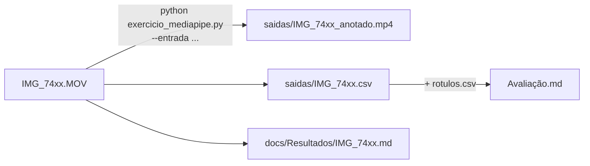

# 🎞️ Vídeos de teste

Cinco vídeos gravados com celular (retrato, 1080×1920, 60 fps, iluminação fluorescente de sala de aula), um para cada grupo de exercícios. O autor aparece nos vídeos e decidiu mantê-los no repositório.

← [README principal](../README.md)

## O que cada vídeo mostra

| Vídeo | Duração | Conteúdo | Exercícios | Resultado anotado |
|---|---|---|---|---|
| `IMG_7457.MOV` | 11,8 s · 709 quadros | abrir e fechar as mãos, contagem com as duas mãos | Ex1 · Ex2 |  |
| `IMG_7458.MOV` | 11,4 s · 682 quadros | contagem de dedos, mão semiaberta | Ex1 · Ex2 |  |
| `IMG_7459.MOV` | 5,5 s · 327 quadros | polegar para cima → polegar para baixo | Ex3 |  |
| `IMG_7460.MOV` | 7,4 s · 442 quadros | boca fechada ↔ bem aberta (sem mãos) | Ex4 |  |
| `IMG_7461.MOV` | 9,7 s · 584 quadros | rosto de frente → esquerda → frente → direita → olhar para cima | Ex5 · pose |  |

Para cada vídeo, o programa gera `saidas/<nome>.csv`, `saidas/<nome>_anotado.mp4` e a nota `docs/Resultados/<nome>.md`.

## Como gravar novos vídeos

Coloque o arquivo nesta pasta (`.mov`, `.mp4`, `.avi`, `.mkv`, `.m4v`). Ele aparece no menu da opção 3 e entra no lote da opção 2.

| Cuidado | Por quê |
|---|---|
| Celular **na altura do rosto e de frente** | com a câmera fora do eixo, o "rosto de frente" já aparece com desvio ~0,12 (aconteceu em IMG_7457/7458) |
| Mão inteira dentro do quadro, a 40–70 cm | dedos cortados pela borda viram contagens erradas |
| Luz de frente, sem contraluz | landmarks falham com o rosto ou a mão escuros |
| Segure cada gesto por ~1 s | a suavização precisa de alguns quadros, e o gabarito fica mais fácil de marcar |
| Anote os tempos de cada gesto | é o que vai em [`rotulos.csv`](../docs/Avaliação/Como%20preencher%20rotulos.csv.md) |
| Grave mais de uma pessoa | o [protocolo](../docs/Avaliação/Protocolo%20de%20testes.md) pede, e os limiares mudam de pessoa para pessoa |
| Peça consentimento | veja [Privacidade](../docs/Conceitos/Privacidade.md) |

A rotação dos `.MOV` é aplicada automaticamente (`CAP_PROP_ORIENTATION_AUTO`), então vídeos em retrato não saem deitados.
