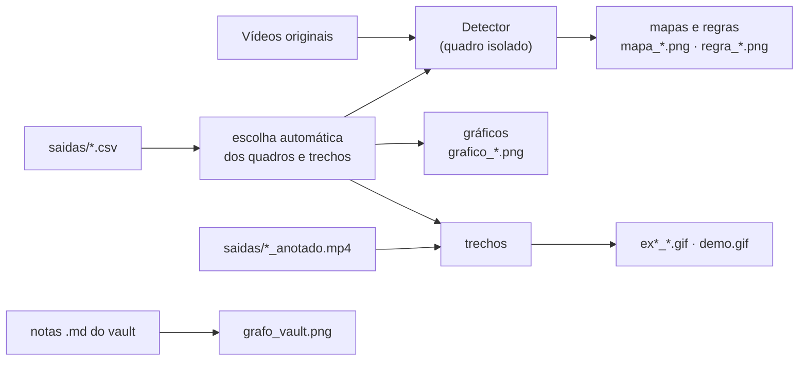

# 🛠️ Ferramentas

## `gerar_midia.py`: GIFs, figuras e gráficos dos READMEs

Toda a mídia de [`assets/`](../assets) é gerada por este script **a partir dos próprios vídeos e CSVs**. Não há nada desenhado à mão: se você trocar um limiar ou gravar novos vídeos, basta regenerar.


← [README principal](../README.md)

```bash
pip install Pillow matplotlib              # além do requirements.txt
python exercicio_mediapipe.py --sem-janela # gera saidas/*.csv e *_anotado.mp4
python ferramentas/gerar_midia.py          # gera assets/
```



## O que é gerado e como cada trecho é escolhido

| Arquivo | Conteúdo | Como o quadro ou trecho é escolhido |
|---|---|---|
| `demo.gif` | Ex2–Ex5 lado a lado | mesmos trechos dos GIFs individuais, 3,5 s |
| `ex1_mao.gif` | IMG_7458 | janela de 4 s com mais trocas de estado da mão |
| `ex2_dedos.gif` | IMG_7457 | janela de 4 s com mais valores distintos de dedos |
| `ex3_polegar.gif` | IMG_7459 | a partir do primeiro "Polegar para cima" |
| `ex4_boca.gif` | IMG_7460 | em torno do pico da proporção da boca |
| `ex5_direcao.gif` | IMG_7461 | em torno do menor desvio do nariz (virado à esquerda) |
| `mapa_mao.png` | 21 landmarks numerados | meio da sequência mais longa com 5 dedos |
| `mapa_rosto.png` | 7 pontos das regras + malha | rosto de frente, boca fechada |
| `regra_dedos.png` | vertical × distância | polegar para baixo (mão invertida) |
| `regra_polegar.png` | diferença 3→4 / tamanho da mão | quadro com a maior \|diferença\| confirmada na detecção |
| `regra_boca.png` | fechada × aberta | primeiro quadro fechado × pico de abertura |
| `regra_direcao.png` | esquerda · frente · direita | meio de cada sequência estável |
| `aspecto.png` | grade normalizada × pixels | diagrama |
| `grafico_boca.png` | proporção × tempo | IMG_7460 inteiro |
| `grafico_direcao.png` | desvio e yaw × tempo (2 painéis, sem eixo duplo) | IMG_7461 inteiro |
| `grafico_suavizacao.png` | dedos brutos × suavizados | janela de 5 s mais variada de IMG_7457 |
| `miniaturas.png` | um quadro anotado por vídeo | quadro representativo de cada exercício |
| `grafo_vault.png` | grafo das notas | links `[[...]]` e `[...](*.md)` das notas; layout de forças com semente fixa |

As cores seguem uma paleta categórica validada para daltonismo (azul, laranja, aqua, amarelo, rosa, verde, violeta, vermelho). Os GIFs usam 64 cores e ~8 fps para ficar perto de 1 MB cada.
