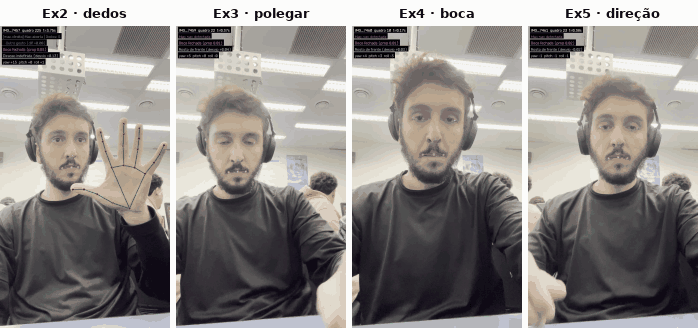
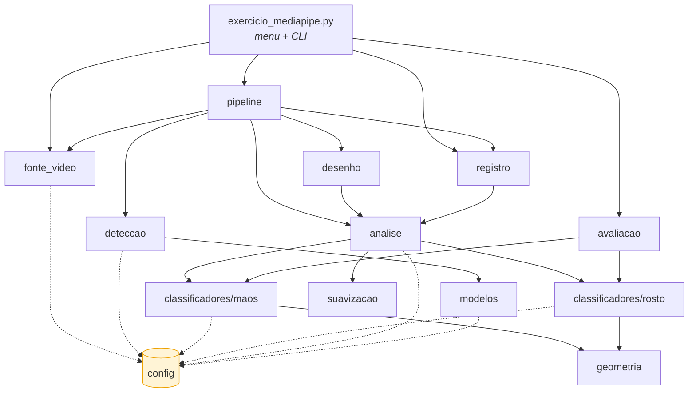
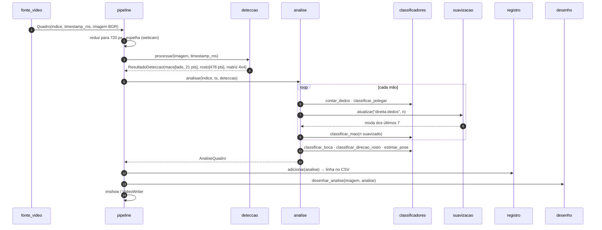
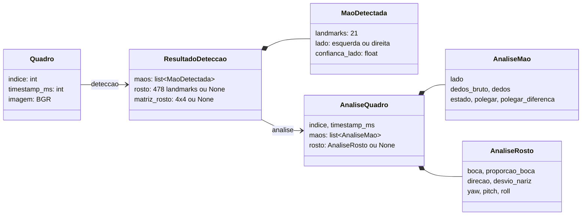
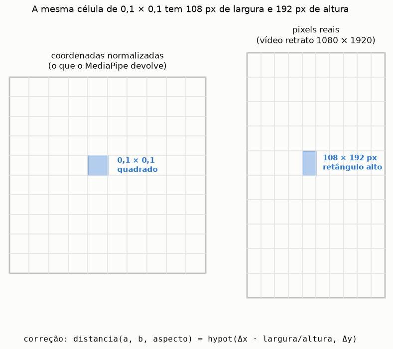

# 📦 `gestos/`: o pipeline do GestoLens

Este pacote transforma quadros de vídeo em rótulos ("Mao aberta", "Polegar para cima", "Boca aberta"…). Cada arquivo cuida de **uma** etapa, e todas as decisões ajustáveis ficam em [`config.py`](config.py).



← voltar ao [README principal](../README.md)

---

## Mapa de dependências

Quem importa quem. As setas vão de quem **usa** para quem **é usado**:



**Como ler:** `config` (em amarelo) é consultado por quase todos e não depende de ninguém: é o único lugar a editar para calibrar. `classificadores` só conhecem `geometria` e `config`, então são funções puras (landmarks entram, rótulos saem) e podem ser testadas sem vídeo nenhum.

---

## O caminho de um quadro



**Pontos-chave, pela numeração:**
- **(1)** O `timestamp_ms` é **estritamente crescente**. No arquivo vem de `índice / fps`; na webcam vem do relógio.
- **(4)** O `lado` da mão já vem corrigido. O MediaPipe presume imagem espelhada, e o `Detector` inverte o rótulo quando a imagem não é espelhada. Detalhes em [Espelhamento](../docs/Conceitos/Espelhamento.md).
- **(7–8)** A suavização tem uma chave por mão. Quando a mão some, a chave é apagada: o Ex1 mostra "Mao nao detectada" e nunca reaproveita o quadro anterior.
- **(9)** O estado da mão é calculado **a partir da contagem já suavizada**, então o número e o estado exibidos nunca se contradizem.

---

## Os dados que circulam



---

## Módulo a módulo

| Arquivo | Responsabilidade | Principais nomes | Nota no vault |
|---|---|---|---|
| [`config.py`](config.py) | caminhos, URLs dos modelos, **todos os limiares** | `LIMIAR_BOCA_ABERTA`, `REGRA_DEDOS`… | [config](../docs/Módulos/config.md) |
| [`modelos.py`](modelos.py) | baixa os `.task` na primeira execução | `garantir_modelo` | [modelos](../docs/Módulos/modelos.md) |
| [`fonte_video.py`](fonte_video.py) | lê arquivo ou webcam, aplica a rotação do `.MOV` e gera os instantes | `FonteVideo`, `Quadro`, `listar_videos` | [fonte_video](../docs/Módulos/fonte_video.md) |
| [`deteccao.py`](deteccao.py) | HandLandmarker + FaceLandmarker em modo VIDEO; corrige a lateralidade | `Detector`, `ResultadoDeteccao` | [deteccao](../docs/Módulos/deteccao.md) |
| [`geometria.py`](geometria.py) | distâncias com correção de aspecto; regras de dedo estendido | `distancia`, `dedos_longos_estendidos` | [geometria](../docs/Módulos/geometria.md) |
| [`classificadores/`](classificadores/README.md) | regras dos exercícios 1–5 | `contar_dedos`, `classificar_boca`… | [maos](../docs/Módulos/maos.md) · [rosto](../docs/Módulos/rosto.md) |
| [`suavizacao.py`](suavizacao.py) | moda temporal por chave | `FiltroModa` | [suavizacao](../docs/Módulos/suavizacao.md) |
| [`analise.py`](analise.py) | aplica classificadores e suavização a um quadro | `Analisador`, `AnaliseQuadro` | [analise](../docs/Módulos/analise.md) |
| [`desenho.py`](desenho.py) | esqueleto da mão, pontos do rosto, painel de texto | `desenhar_analise` | [desenho](../docs/Módulos/desenho.md) |
| [`registro.py`](registro.py) | CSV por quadro, `resumo.csv`, notas de resultado | `RegistroVideo`, `salvar_resumo` | [registro](../docs/Módulos/registro.md) |
| [`avaliacao.py`](avaliacao.py) | compara com `rotulos.csv` | `avaliar`, `Placar` | [avaliacao](../docs/Módulos/avaliacao.md) |
| [`pipeline.py`](pipeline.py) | laço principal, janela e gravação | `processar_fonte`, `OpcoesPipeline` | [pipeline](../docs/Módulos/pipeline.md) |

Todas as funções e classes têm docstring em português, com **Parâmetros / Retorna / Levanta**. Use `help(gestos.analise.Analisador)` no Python para ler.

---

## Uma armadilha escondida: a proporção da imagem



O MediaPipe devolve `x` dividido pela **largura** e `y` dividido pela **altura**. Num vídeo em retrato (1080×1920), 0,1 em x são 108 px, mas 0,1 em y são 192 px. Qualquer distância "diagonal" calculada direto nas coordenadas normalizadas sai distorcida. A proporção da boca, por exemplo, sairia ~1,8× maior. Por isso `geometria.distancia` recebe `aspecto = largura / altura` e corrige Δx. Mais em [Proporção da imagem](../docs/Conceitos/Proporção%20da%20imagem.md).

---

## Usar o pacote no seu código

```python
from gestos.fonte_video import FonteVideo
from gestos.deteccao import Detector
from gestos.analise import Analisador

with FonteVideo(0) as fonte, Detector(imagem_espelhada=True) as detector:   # 0 = webcam
    analisador = None
    for quadro in fonte.quadros():
        imagem = quadro.imagem[:, ::-1].copy()                              # espelha
        h, w = imagem.shape[:2]
        analisador = analisador or Analisador(aspecto=w / h)
        analise = analisador.analisar(quadro.indice, quadro.timestamp_ms,
                                      detector.processar(imagem, quadro.timestamp_ms))
        for mao in analise.maos:
            print(mao.lado, mao.dedos, mao.estado, mao.polegar)
```
