# 🧮 `classificadores/`: as regras, ilustradas

Aqui ficam as **regras geométricas** dos cinco exercícios. São funções puras: recebem landmarks e devolvem um rótulo e o número que levou à decisão. Todos os limiares estão em [`../config.py`](../config.py).

| Arquivo | Exercícios |
|---|---|
| [`maos.py`](maos.py) | Ex1 estado da mão · Ex2 contagem de dedos · Ex3 polegar |
| [`rosto.py`](rosto.py) | Ex4 boca · Ex5 direção do rosto · extensão: yaw, pitch, roll |

← [pipeline (`gestos/`)](../README.md) · [README principal](../../README.md)

---

## Os pontos de referência

| Mão: 21 landmarks | Rosto: os 7 usados (de 478) |
|---|---|
| 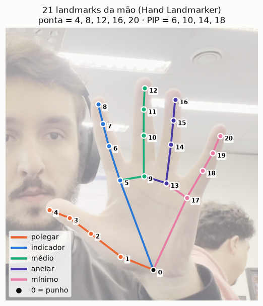 | 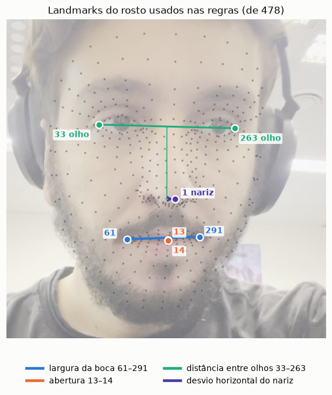 |

- **Mão:** 0 é o punho. Cada dedo tem base (MCP), articulação do meio (PIP), articulação da ponta (DIP) e ponta. As regras usam **pontas** 4, 8, 12, 16, 20, **PIPs** 6, 10, 14, 18, o polegar 3→4 e a base do indicador (5).
- **Rosto:** a boca usa 13/14 (lábios internos) e 61/291 (cantos). A direção usa 33/263 (cantos externos dos olhos) e 1 (ponta do nariz).

> Todas as distâncias passam por `geometria.distancia(a, b, aspecto)`, que corrige a diferença de escala entre x e y em vídeos não quadrados. Veja a [ilustração](../README.md#uma-armadilha-escondida-a-proporção-da-imagem).

---

## Ex2: contar dedos (`contar_dedos`)

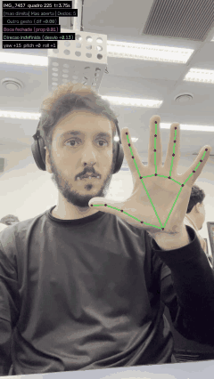

**Dedos longos:** um dedo está estendido quando a **ponta está mais longe do punho que a PIP**:

```
dist(ponta, punho) > dist(PIP, punho)      # indicador 8/6, médio 12/10, anelar 16/14, mínimo 20/18
```

**Polegar:** está estendido quando a ponta se afasta da base do indicador:

```
dist(4, 5) > dist(3, 5) × 1,15             # FATOR_POLEGAR_ESTENDIDO
```

**Total** = dedos longos + polegar, de 0 a 5. A contagem exibida passa pela moda dos últimos 7 quadros ([`suavizacao`](../suavizacao.py)).

<br clear="right">

### Por que não a regra vertical do código-base?

A proposta compara `y(ponta) < y(PIP)`, ou seja, se a ponta está "mais alta" que a articulação. Isso só vale com a mão **em pé**. Veja o mesmo quadro de *polegar para baixo* avaliado pelas duas regras:

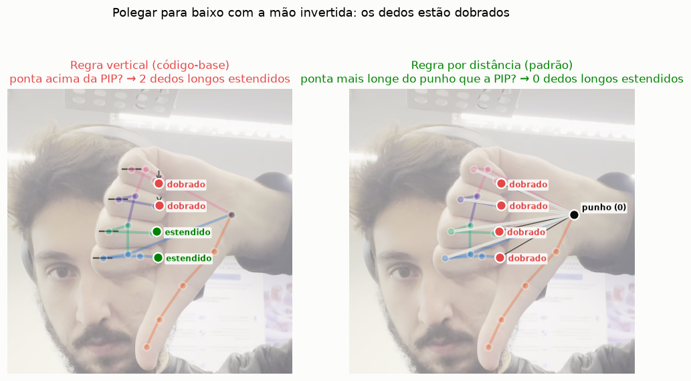

Com a mão invertida, as pontas dos dedos dobrados ficam **acima** das articulações, e a regra vertical conta 2 dedos "estendidos". A regra por distância ao punho não depende da rotação da mão no plano da imagem e acerta (0). Para comparar as duas, troque em `config.py`:

```python
REGRA_DEDOS = "vertical"   # regra original da proposta
```

### O efeito da suavização

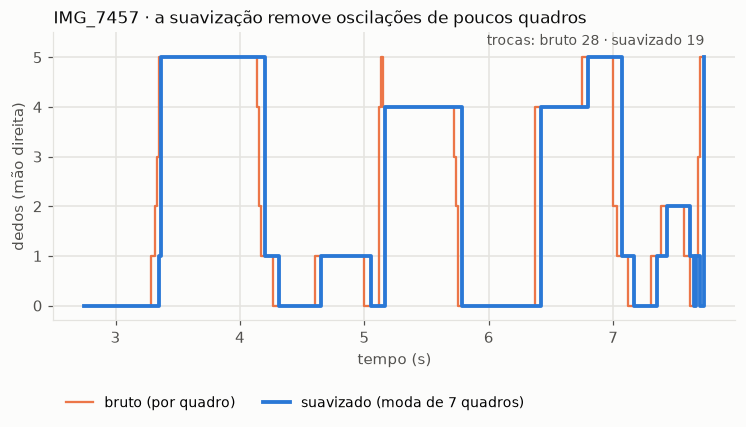

A linha laranja (bruta) pula por um ou dois quadros durante as transições. A azul (moda de 7 quadros, ~0,12 s a 60 fps) troca de valor menos vezes, ao custo de um pequeno atraso.

---

## Ex1: mão aberta / fechada (`classificar_mao`)

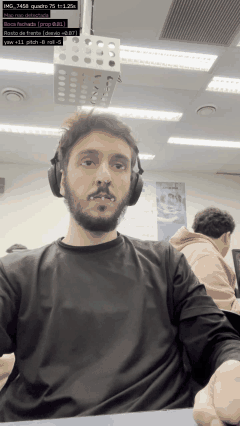

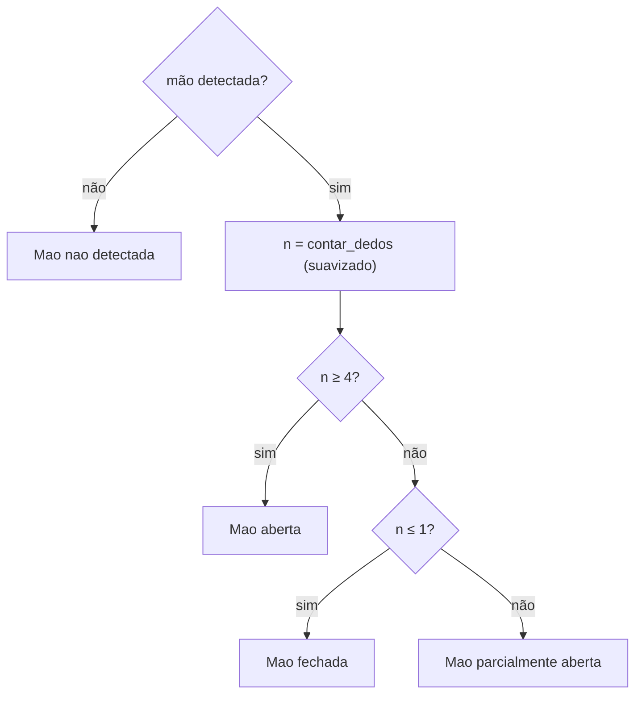

Limiares: `DEDOS_MAO_ABERTA = 4` e `DEDOS_MAO_FECHADA = 1`. Quando a mão sai do quadro, o histórico dela é apagado, então o rótulo **nunca** é herdado do quadro anterior.

<br clear="right">

---

## Ex3: polegar para cima / para baixo (`classificar_polegar`)

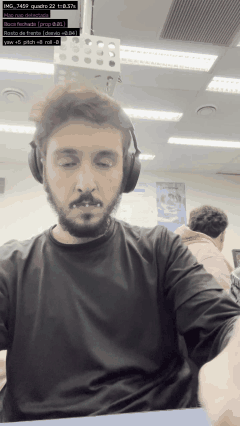

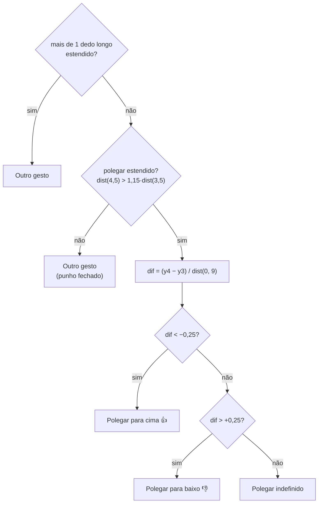

<br clear="right">

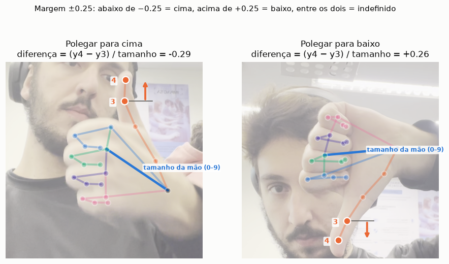

- A diferença vertical entre a ponta (4) e a articulação (3) é **dividida pelo tamanho da mão** (punho 0 → base do médio 9). Assim, a margem ±0,25 vale para a mão perto ou longe da câmera. O `0.04` absoluto do código-base mudava de significado com a distância.
- A faixa entre −0,25 e +0,25 é **indefinida** de propósito: um polegar deitado não deve oscilar entre cima e baixo.
- Só usa y, então **não** depende de a mão ser esquerda ou direita nem do espelhamento.

---

## Ex4: boca aberta / fechada (`classificar_boca`)

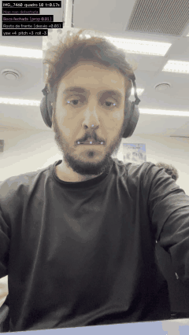

```
proporção = dist(13, 14) / dist(61, 291)      # abertura / largura
proporção > 0,15  →  "Boca aberta"            # LIMIAR_BOCA_ABERTA
```

Dividir pela largura torna a medida independente do tamanho do rosto na imagem. A proporção aparece no vídeo (`prop 0.xx`) e no CSV para calibração.

<br clear="right">

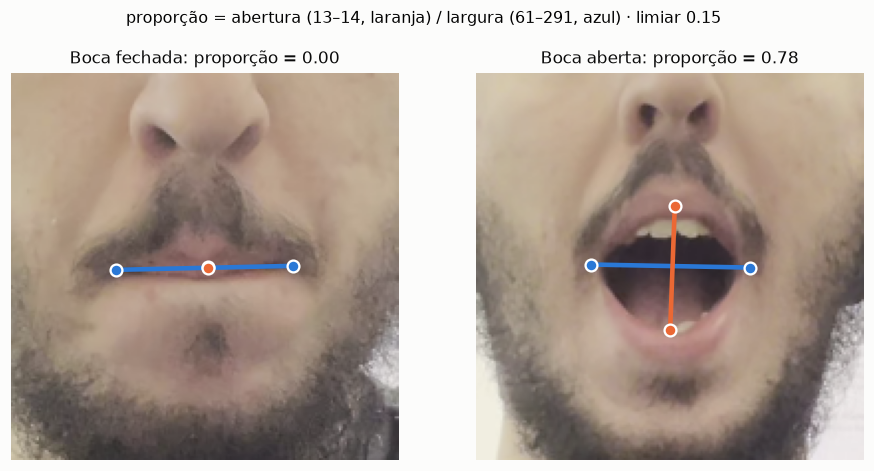

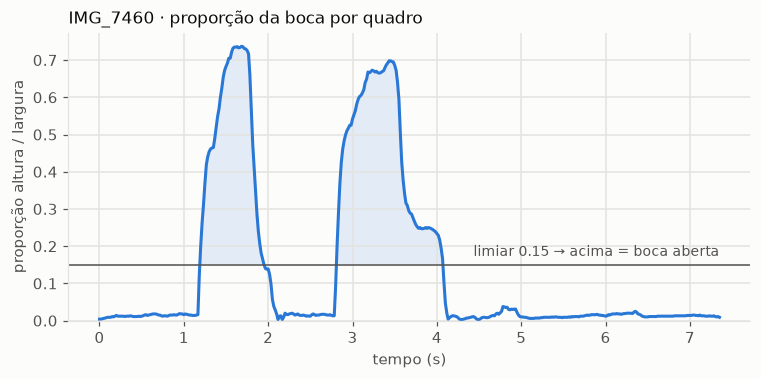

Nos vídeos, a boca fechada fica entre 0,00 e 0,02 e a boca aberta chega a 0,78. O limiar 0,15 tem folga dos dois lados. **Sorriso** alarga a boca e reduz a proporção (falso negativo); **fala** oscila rapidamente.

---

## Ex5: direção do rosto (`classificar_direcao_rosto`)

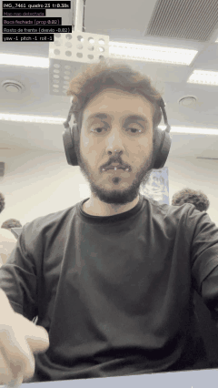

```
centro = (x33 + x263) / 2
desvio = (x1 − centro) / |x263 − x33|
```

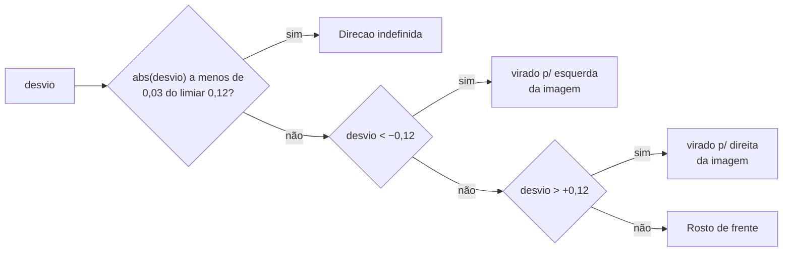

<br clear="right">

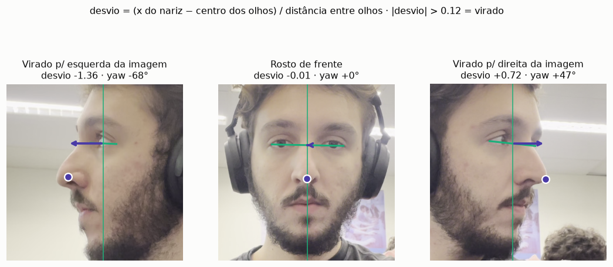

Os rótulos dizem **"da imagem"** de propósito. Com espelhamento (webcam), esquerda e direita trocam de lado, e escrever em relação ao que é exibido elimina a ambiguidade do "um lado / outro lado" da proposta.

### Extensão: yaw, pitch e roll (`estimar_pose`)

O Face Landmarker também devolve uma **matriz 4×4** que encaixa um rosto 3D canônico na imagem. Dela saem os três ângulos da cabeça:

| Ângulo | Movimento | Fórmula (R = bloco 3×3) |
|---|---|---|
| **yaw** | girar para os lados | `atan2(R02, R22)` |
| **pitch** | olhar para cima/baixo | `asin(−R12)` |
| **roll** | inclinar para o ombro | `atan2(R10, R11)` |

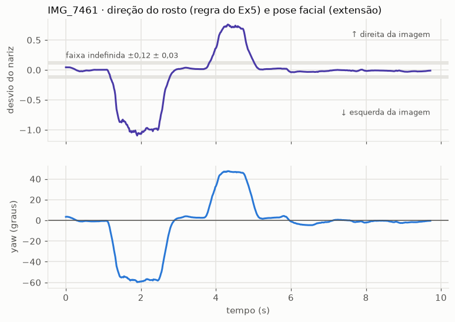

As duas medidas concordam. O yaw, porém, usa o rosto inteiro e tem unidade física (graus), o que o torna mais robusto que o deslocamento de um único ponto.

---

## Testando uma regra isoladamente

Os classificadores só precisam de objetos com `.x` e `.y`:

```python
from types import SimpleNamespace as P
from gestos.classificadores import classificar_boca

rosto = [P(x=0.5, y=0.5)] * 478
rosto[13], rosto[14] = P(x=0.50, y=0.60), P(x=0.50, y=0.64)   # abertura 0,04
rosto[61], rosto[291] = P(x=0.45, y=0.62), P(x=0.55, y=0.62)  # largura 0,10
print(classificar_boca(rosto))   # ('Boca aberta', 0.4000000000000002)
```
