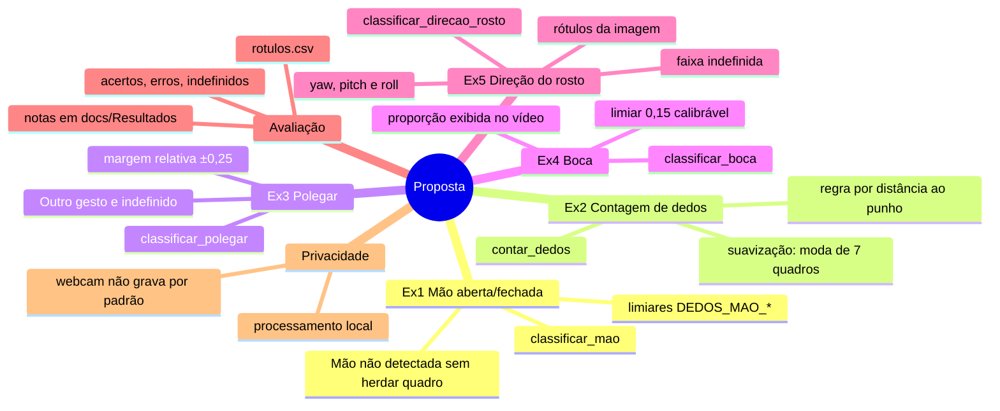

# 📄 A proposta

[`exercicios_mediapipe.pdf`](exercicios_mediapipe.pdf): *Exercícios práticos: Reconhecimento de gestos e expressões com MediaPipe* (Computação Visual · Atividades práticas).

← [README principal](../README.md)

## Resumo

Cinco atividades com **Python + OpenCV + MediaPipe** que usam landmarks da mão e do rosto e regras geométricas para classificar gestos e estados faciais. O próprio enunciado avisa que as regras são **heurísticas didáticas**, que devem ser testadas e calibradas porque falham com a pose, a luz, a distância e as diferenças individuais.

**Objetivos de aprendizagem:** processar quadros com OpenCV · interpretar landmarks normalizados · construir classificadores a partir de distâncias · testar limites, registrar erros e discutir as limitações.

## Da proposta ao código: onde está cada coisa

| Pedido da proposta | Onde foi atendido |
|---|---|
| Código-base com `mp.solutions` e webcam | reescrito com **MediaPipe Tasks** (a API antiga não existe nas versões atuais). Webcam **ou** vídeos gravados, pelo menu |
| Ex1: "mão não detectada" sem reutilizar o quadro anterior | `analise.py` apaga o histórico da mão ausente · [nota](../docs/Exercícios/Ex1%20-%20Mão%20aberta%20e%20fechada.md) |
| Ex2: registrar ≥ 3 contagens incorretas | casos em [Ex2](../docs/Exercícios/Ex2%20-%20Contagem%20de%20dedos.md) e [ilustração](../gestos/classificadores/README.md#por-que-não-a-regra-vertical-do-código-base) |
| Ex2 (extensão): suavização temporal | `suavizacao.py` · [gráfico](../assets/grafico_suavizacao.png) |
| Ex3: calibrar a margem de 0.04; "outro gesto" | margem relativa ao tamanho da mão · [nota](../docs/Exercícios/Ex3%20-%20Polegar%20para%20cima%20e%20para%20baixo.md) |
| Ex3: por que esquerda/direita mudam com o espelho? | [Espelhamento](../docs/Conceitos/Espelhamento.md) |
| Ex4: mostrar a proporção; escolher e justificar o limiar | painel do vídeo + CSV · [gráfico](../assets/grafico_boca.png) · [nota](../docs/Exercícios/Ex4%20-%20Boca%20aberta%20e%20fechada.md) |
| Ex5: rótulos explícitos quanto ao espelhamento; estado indefinido | "p/ esquerda da imagem" + faixa ±0,03 · [nota](../docs/Exercícios/Ex5%20-%20Direção%20do%20rosto.md) |
| Ex5 (extensão): yaw, pitch, roll | `estimar_pose` · [Pose facial](../docs/Conceitos/Pose%20facial.md) |
| Protocolo de testes (calibração ≠ avaliação, tabela) | [Protocolo de testes](../docs/Avaliação/Protocolo%20de%20testes.md) · `avaliacao.py` |
| Limitações e privacidade | [Limitações](../docs/Avaliação/Limitações.md) · [Privacidade](../docs/Conceitos/Privacidade.md) |
| Entrega: código, regras, tabela de testes, reflexão | código em `gestos/` · regras em [classificadores](../gestos/classificadores/README.md) · tabela em `docs/Resultados/Avaliação.md` · reflexão nas notas de exercício |
